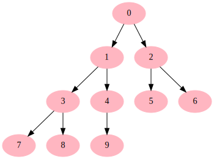

# Installation

To install **cpgetools**, execute the following command in your terminal:

```bash $ pip install cpgetools ```

This command ensures the installation of the latest version of cpgetools."

# Usage


```python
from cpgetools.trees import draw_tree,tree_from_dfs
```


```python
A=tree_from_dfs(range(10))
```


```python
A
```


    [0,
     [1, [3, [7, [], []], [8, [], []]], [4, [9, [], []], []]],
     [2, [5, [], []], [6, [], []]]]


```python
draw_tree(A)
```


    

    


```python

```
